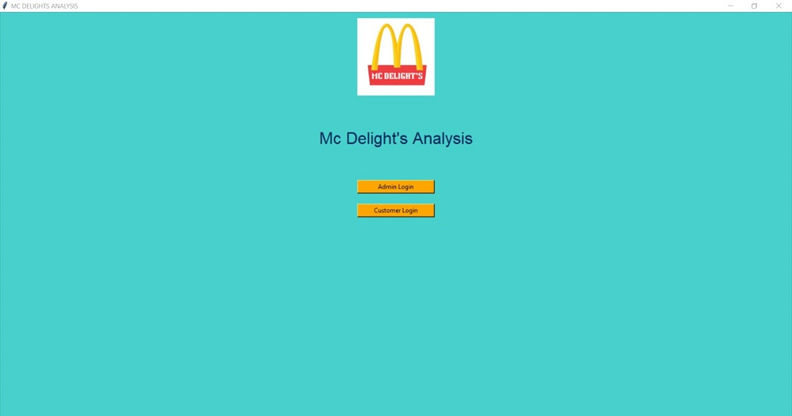
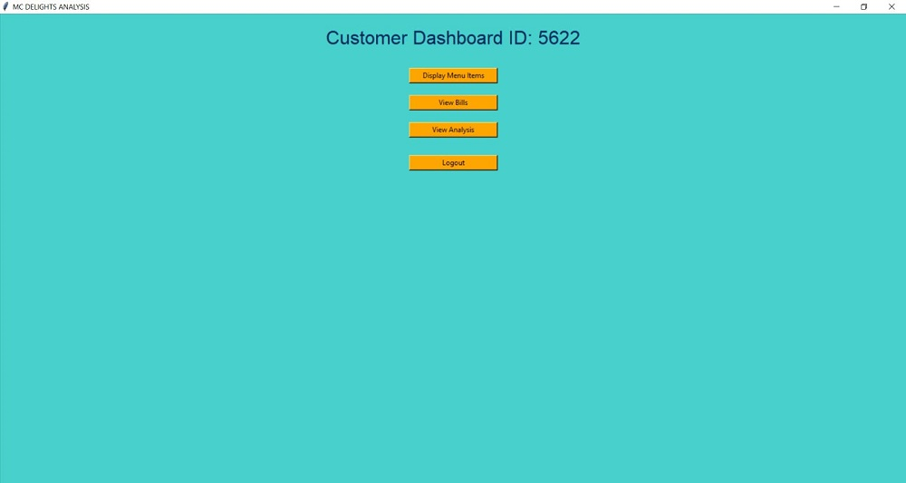
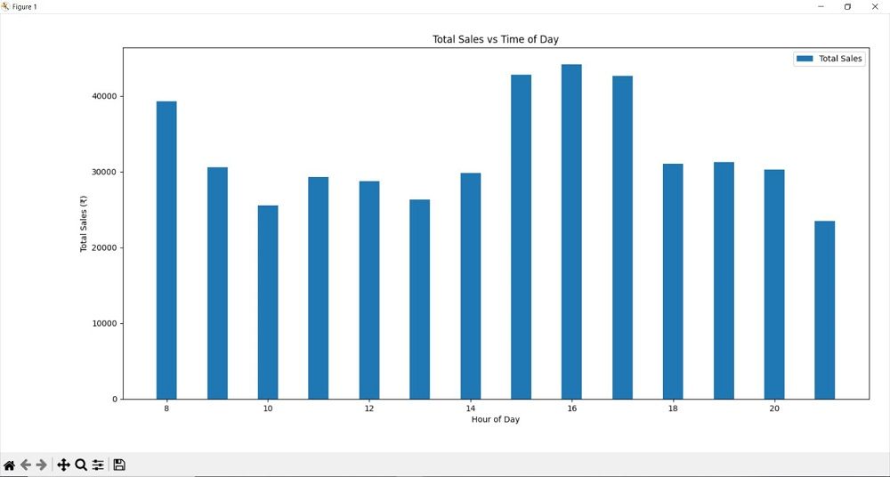
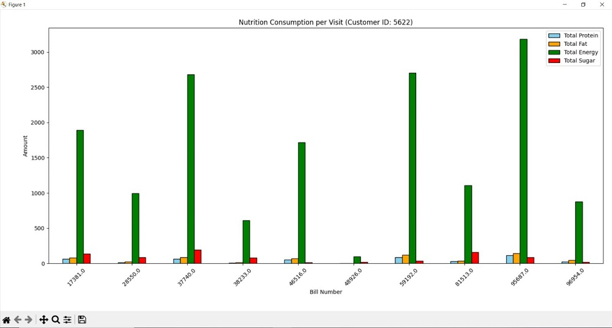

# McDelight Analysis 🍽️📊
A Python Tkinter desktop application for managing a restaurant's menu, customers, billing, and performance analytics.

## Features
- **Owner Dashboard**: Manage menu, customers, and billing with real-time CSV updates.
- **Customer Dashboard**: View menu, place orders, and track past bills.
- **Analytics**: Sales trends, popular items, and nutritional stats via Matplotlib.
- **UI Enhancements**: Responsive grid layout, dynamic tables, consistent color scheme.

## Tech Stack
Python | Tkinter | Pandas | Matplotlib | PIL | CSV

## Installation
```bash
pip install pandas matplotlib pillow
python app.py

## 📸 Screenshots

### 🔐 Lock Screen


---

### 🛠 Owner Dashboard


---

### 👤 Customer Dashboard


---

### 📊 Analytics & Reports

#### Sales Vs Time Of Day


#### Nutrition Consumption Per Visit

